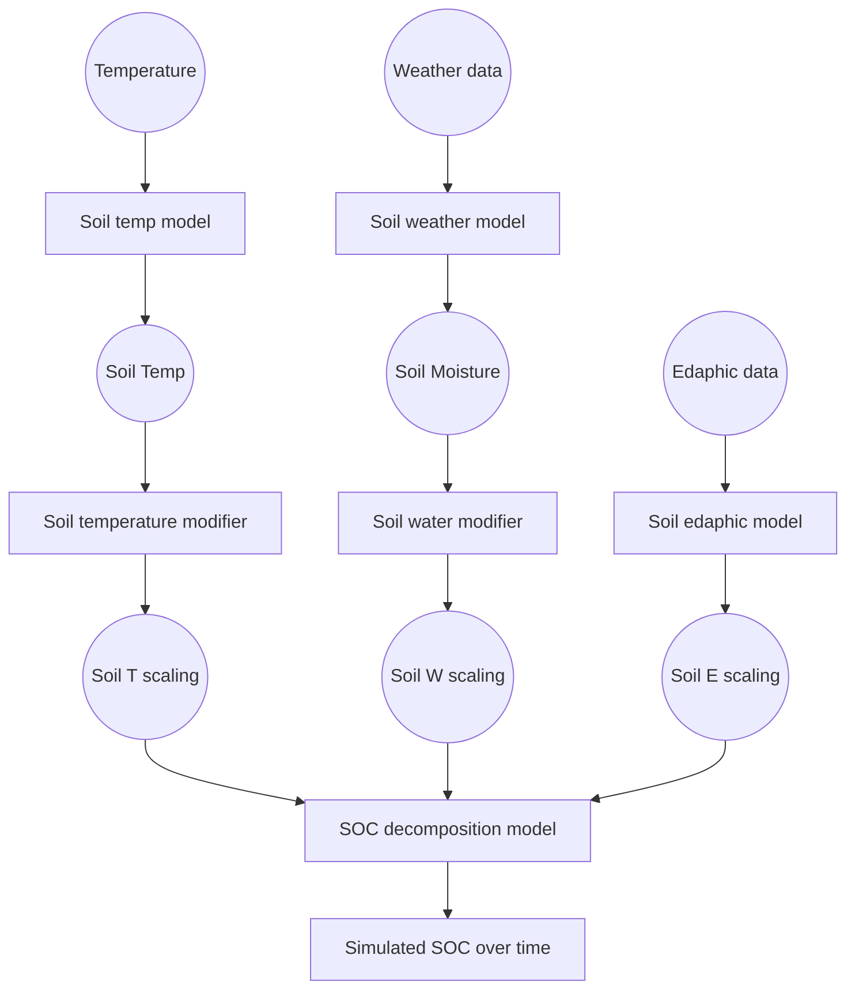

# Scope
This documents describes the theory behind the library of functions developed for the SweSOC project.  
The library is a generic and modular SOC modeling framework, including a few models and climate scaling functions, together with a few implementation of Bayesian model comparison approaches. The frameworks is built for modularity and generalization, so that all functions can be combined easily with each other.  
The main purpose of this document is to provide documentation for each building block (with emphasis on the collection of scaling functions and SOC decomposition models).


# Main modeling blocks
The soil SOC evolution is generally simulated with a compartmental SOC model and some functions linearly scaling the decomposition kinetics, so very coarsely:

Each of these operator blocks (the square blocks) can be represented by different functions, and will be written as a separate module. All modules operating the same function will be interchangeable.


# General SOC model structure
Any compartmental soil organic matter decomposition model can be written as:
$$
\frac{dC}{dt} = I - \xi \cdot A \cdot C
$$

Which in extended form becomes:

$$
\frac{d}{dt} \begin{bmatrix} C_1 \\  C_2 \\ \vdots \\ C_n \end{bmatrix} = \begin{bmatrix} I_1 \\ I_2 \\ \vdots \\ I_n \end{bmatrix} - \xi \cdot \begin{bmatrix}
k_{1} & h_{12} & \cdots & h_{1n} \\
h_{21} & k_{2} & \cdots & h_{2n} \\
\vdots & \vdots & \ddots & \vdots \\
h_{n1} & h_{n2} & \cdots & k_{n}
\end{bmatrix} \begin{bmatrix} C_1 \\ C_2 \\ \vdots \\ C_n \end{bmatrix}
$$

the $\xi$ term is a scalar interacting linearly with all the kinetic terms $k$ and summarizes all the interactions with decomposition kinetics. These can be climatic (for all models) and edaphic (some models only).

$$
\xi = \xi_{temp} \cdot \xi_{moist} \cdot \xi_{clay} \cdot \xi_{...}
$$


# Climate and edaphic interactions
Climate and edaphic interactions are considered as scaling of the kinetics $k$

## Simulation of soil temperature

## Simulation of soil moisture


## Climate scaling functions
The functions collected in this library are from various models

### Temperature scaling functions
#### RothC

#### ICBMa: Arrhenius

#### ICBMb: Ratkowski

#### Century

````python
def Andren_Katterer(TempC):
    '''
The dependence of decomposition rates on soil temperature was calculated following Andren and Katterer 2001 equation (27)
The function calculates the effects of temperature on decomposition rates according to the Arrhenius equation and returns 
A scalar or a vector containing the effects of temperature on decomposition rates (unitless).

TempC: A scalar or vector containing values of temperature (in degrees celcius) for which the effects on decomposition rates are calculated.
note This function returns NA for Temp <= -4

    
    '''
    rateandren=((TempC--4)**2)/(23--4)**2
    rateandren=np.where(rateandren<-4, np.nan, rateandren)
    return rateandren

def arrhenius_factor(TempC, A=1000,Ea=75000, Re=8.3144621):
    '''
Effects of temperature on decomposition rates according the Arrhenius
equation
The function calculates the effects of temperature on decomposition rates according to the Arrhenius equation and returns 
A scalar or a vector containing the effects of temperature on decomposition rates (unitless).

TempC: A scalar or vector containing values of temperature (in degrees celcius) for which the effects on decomposition rates are calculated.
A: A scalar defining the pre-exponential factor.
Ea: A scalar defining the activation energy in units of J mol^-1.
Re A scalar defining the universal gas contents in units of J K^-1 mol^-1.

    '''
    Temp=TempC+273.16
    arr_factor=A*np.exp(-Ea/(Re*Temp))
    return arr_factor
    
def ft_RothC(TempC):
    
    '''
    
Effects of temperature on decomposition rates according to the functions
 included in the RothC model
 
 Calculates the effects of temperature on decomposition rates according to
the functions included in the RothC model.
 
 Temp A scalar or vector containing values of temperature for which
 the effects on decomposition rates are calculated.
 return A scalar or a vector containing the effects of temperature on
 decomposition rates (unitless).
  @note This function returns NA for Temp <= -18.3
  @references Jenkinson, D. S., S. P. S. Andrew, J. M. Lynch, M. J. Goss, and
   P. B. Tinker (1990), The Turnover of Organic Carbon and Nitrogen in Soil,
   Philosophical Transactions: Biological Sciences, 329(1255), 361-368.
    
    '''
    #Temp=TempC+273.16
    ft_rothC=47.9/(1+np.exp(106/(np.where(TempC<= -18.3, np.nan, TempC)+18.3)))
    return ft_rothC


def ft_Century(TempC):
    ''' 
    #' Effects of temperature on decomposition rates according the the CENTURY
#' model

#' Calculates the effects of temperature on decomposition rates according to
#' the CENTURY model.

#' @param Temp A scalar or vector containing values of temperature for which
#' the effects on decomposition rates are calculated.
#' @param Tmax A scalar defining the maximum temperature in degrees C.
#' @param Topt A scalar defining the optimum temperature for the decomposition
#' process in degrees C.
#' @return A scalar or a vector containing the effects of temperature on
#' decomposition rates (unitless).
#' @references Adair, E. C., W. J. Parton, S. J. D. Grosso, W. L. Silver, M. E.
#' Harmon, S. A. Hall, I. C. Burke, and S. C. Hart. 2008.  Simple three-pool
#' model accurately describes patterns of long-term litter decomposition in
#' diverse climates. Global Change Biology 14:2636-2660.
    
    '''
    Tmax=45,   
    Topt=35
    ft_cent=3.439423*np.exp((0.2/2.63)*(1-(((Tmax-TempC)/(Tmax-Topt))**2.63))*((Tmax-TempC)/(Tmax-Topt))**0.2)
    return ft_cent


def ratkowski(TempC, 
                           C=0.00522739,
                           DHA=69.515,
                           n=388,
                           DH=5311,
                           DCp=81.36):
    Maxtemp=308.3 #temperature where proteins start to denaturate, taken from Ratkowski 2005, tab2, Tmes of S. thermophilus K120-6
    Temp=TempC+273.16
     
    # Ratkowski 2005 part
    r_ratkowski=(C*Temp*np.exp(-DHA/(8.314*Temp)))/(1+np.exp(-n*(DH-18.1*Temp+DCp*((Temp-373.6)-Temp*np.log(Temp/385.2)))/(8.314*Temp)))

    return   r_ratkowski
    
def lloyd_taylor(TempC):
    E0=308.56
    Tmin=227.13
    Temp=TempC+273.16
    Ea=53 # following lloyd and taylor 1994 paper
    lloyd_taylor_r= 0.1604316*np.exp((Ea*1000/(283.15*8.314))*(1-(283.15/Temp)))
    return lloyd_taylor_r
# following equation 11 as described in lloyd and taylor 1994 paper
def lloyd_taylor_11(TempC):
      E0=308.56
      Tmin=227.13
      Temp=TempC+273.16
      Q10= np.exp(10*E0/(Temp-Tmin)**2)
      R=Q10*np.exp(E0*((1/56.02)-(1/(Temp-Tmin))))
      return R
  
def combined_ratkowski_lloyd_taylor(TempC,C=0.00522739,
                           DHA=69.515,
                           n=388,
                           DH=5311,
                           DCp=81.36):
    Maxtemp=308.3
    Temp=TempC+273.16
    r_ratkowski_mod=(C*Temp[Temp>Maxtemp]*np.exp(-DHA/(8.314*Temp[Temp>Maxtemp])))/(1+np.exp(
        -n*(DH-18.1*Temp[Temp>Maxtemp]+DCp*((Temp[Temp>Maxtemp]-373.6)-Temp[Temp>Maxtemp]*np.log(Temp[Temp>Maxtemp]/385.2)))/(8.314*Temp[Temp>Maxtemp])))
    r_ratkowski_mod=np.where(r_ratkowski_mod>1, 1, r_ratkowski_mod)
    
    # Lloyd and Taylor 1996 part
    E0=308.56
    Tmin=227.13
    r_lloyd=(47.2548*np.exp(-E0/(Temp[Temp<Maxtemp]-Tmin)))
    r_lloyd=np.where(r_lloyd>1,1, r_lloyd)
    combined_r=np.concatenate((r_lloyd,r_ratkowski_mod))
    return combined_r
````
<p><img src="Fig2.png"


# Moisture scaling functions


# General SOC model initialization approach


# Calibration approaches

## ICBM multi-site recalibration

## Multi-model multi-site recalibration

## Multi-model Bayesian factorial comparison
