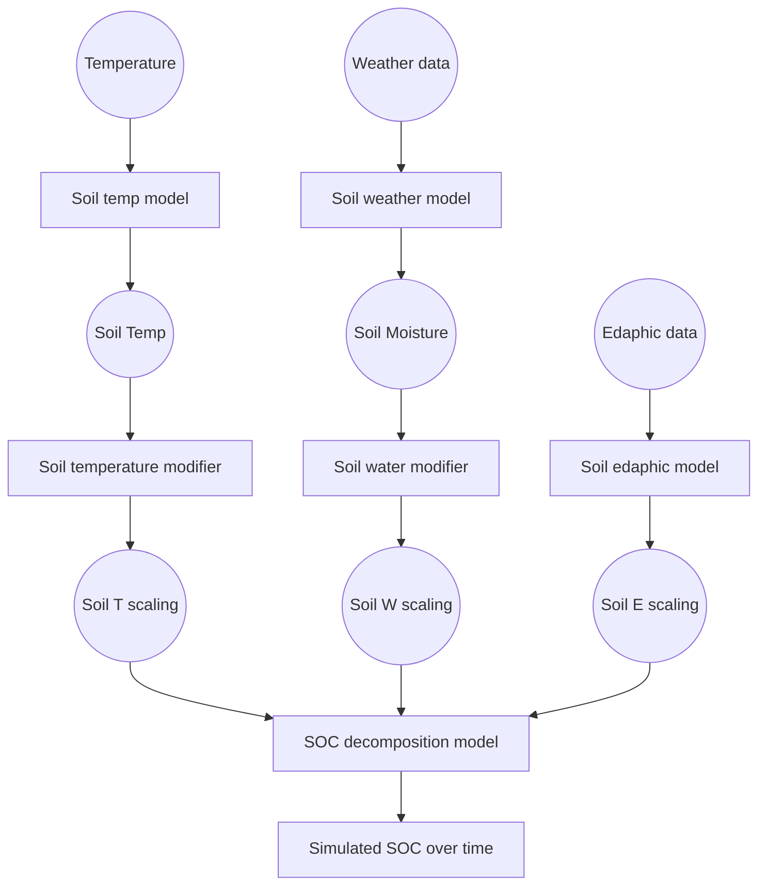

# Scope
This documents describes the theory behind the library of functions developed for the "Carbon sequestration in Swedish cropland soils" project (FORMAS).  
The library is a generic and modular SOC modeling framework, including a few models and climate scaling functions, together with a few implementation of Bayesian model comparison approaches. The frameworks is built for modularity and generalization, so that all functions can be combined easily with each other.  
The main purpose of this document is to provide documentation for each building block (with emphasis on the collection of scaling functions and SOC decomposition models).

# Main modeling blocks
The soil SOC evolution is generally simulated with a compartmental SOC model and some functions linearly scaling the decomposition kinetics, so very coarsely:

Each of these operator blocks (the square blocks) can be represented by different functions, and will be written as a separate module. All modules operating the same function will be interchangeable.

# General SOC model structure
Any compartmental soil organic matter decomposition model can be written as:
$$
\frac{dC}{dt} = I - \xi \cdot A \cdot C
$$

Which in extended form becomes:

$$
\frac{d}{dt} \begin{bmatrix} C_1 \\  C_2 \\ \vdots \\ C_n \end{bmatrix} = \begin{bmatrix} I_1 \\ I_2 \\ \vdots \\ I_n \end{bmatrix} - \xi \cdot \begin{bmatrix}
k_{1} & h_{12} & \cdots & h_{1n} \\
h_{21} & k_{2} & \cdots & h_{2n} \\
\vdots & \vdots & \ddots & \vdots \\
h_{n1} & h_{n2} & \cdots & k_{n}
\end{bmatrix} \begin{bmatrix} C_1 \\ C_2 \\ \vdots \\ C_n \end{bmatrix}
$$

the $\xi$ term is a scalar interacting linearly with all the kinetic terms $k$ and summarizes all the interactions with decomposition kinetics. These can be climatic (for all models) and edaphic (some models only).

$$
\xi = \xi_{temp} \cdot \xi_{moist} \cdot \xi_{clay} \cdot \xi_{...}
$$

# Climate and edaphic interactions
Climate and edaphic interactions are considered as scaling of the kinetics $k$

## Simulation of soil temperature

## Simulation of soil moisture

## Climate scaling functions
The functions collected in this library are from various models

### Temperature scaling functions

#### RothC

#### ICBMa: Arrhenius

#### ICBMb: Ratkowski

#### Century

### Moisture scaling functions

# General SOC model initialization approach

# Calibration approaches

## ICBM multi-site recalibration

## Multi-model multi-site recalibration

## Multi-model Bayesian factorial comparison
